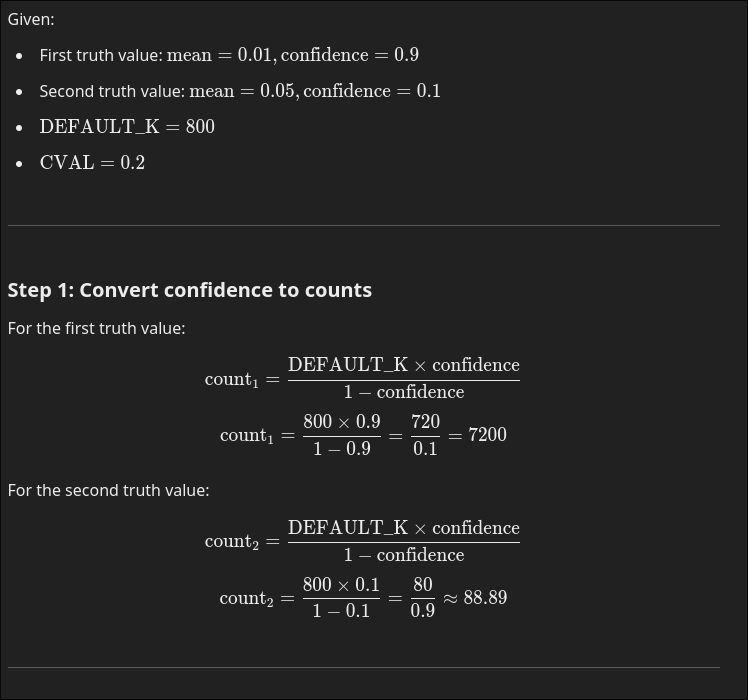
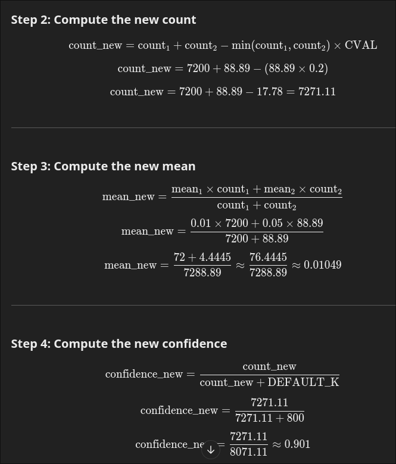
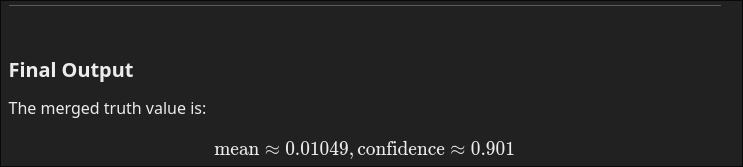

# **HebbianUpdatingAgent::run()**

The `run()` function first retrieves atoms in `attentional_focus` and passes them to the **updateHebbianLinks(source)**, which is the main function for updating Hebbian links.

---

## **updateHebbianLinks(source)**

1. Defines `tcDecayRate` to determine how much the old truth value will change and how much the new truth will persist.  
   `tcDecayRate` is set to `0.1f`.  

   ```c++
    void HebbianUpdatingAgent::updateHebbianLinks(Handle source)
    {
        double tcDecayRate = 0.1f;
        double tc, old_tc, new_tc;

        IncomingSet links = source->getIncomingSetByType(ASYMMETRIC_HEBBIAN_LINK);
        .
        .
        .
    }
```

2. Declares variables `tc`, `old_tc`, and `new_tc` to hold computed results and old truth values.  

   - `tc` is the mean that will be used to create the STV.  

3. `links` holds the incoming sets that have the Asymmetric Hebbian link type.  

   ```c++
     for (const Handle& h : links) {
        if (source != h->getOutgoingAtom(0))
            continue;
        const HandleSeq& outgoing = h->getOutgoingSet();
        new_tc = targetConjunction(outgoing);

        // old link strength decays
        TruthValuePtr oldtv  = h->getTruthValue();
        old_tc = oldtv->get_mean();
        tc = tcDecayRate * new_tc + (1.0 - tcDecayRate) * old_tc;
        std::cout<<"tc: "<<tc<<std::endl;
        //update truth value accordingly
        TruthValuePtr newtv = SimpleTruthValue::createTV(tc, 0.1);
        h->setTruthValue(h->getTruthValue()->merge(newtv));
        std::cout<<"after truthvalue update" << h->to_string()<<std::endl;
    }
    ```

4. The loop iterates through the incoming links and performs the following:  

   - Checks if the `source` (first node passed to `updateHebbianLinks`) matches the outgoing set's first element. If not, it skips the update for that link. Otherwise, it proceeds with the update.

5. Retrieves the outgoing sets and passes them to `targetConjunction`, which ensures the elements are exactly 2.  

   If valid, it computes the conjunction using the following functions:  

   - **`get_av`**: Retrieves the `attentionValue` of the outgoing sets.  
   - **`getNormalisedZeroToOneSTI`**: Normalizes the value using the formula:  

     ```c++
     double HebbianUpdatingAgent::targetConjunction(HandleSeq handles)
    {
        if (handles.size() != 2)
        {
            throw RuntimeException(
                    TRACE_INFO,
                    "Size of outgoing set of a hebbian link must be 2.");
        }

        auto normsti_i = _bank->getNormalisedZeroToOneSTI(get_av(handles[0]), true, true);
        auto normsti_j = _bank->getNormalisedZeroToOneSTI(get_av(handles[1]), true, true);
        double conj = (normsti_i * normsti_j) + ((normsti_j - normsti_i) * std::abs(normsti_j -normsti_i));

        conj = (conj + 1.0) / 2.0;
        std::cout<<"av: " << (*get_av(handles[0])).to_string()<<std::endl;
        std::cout << " Handles: " <<handles[0]->to_string() <<" normsti_i: " <<normsti_i <<"normsti_j: "<<normsti_j<<" conj: "<<conj<<std::endl;
        return conj;
    }
     ```

code

     ```c++
        double AttentionBank::getNormalisedZeroToOneSTI(AttentionValuePtr av,
                                            bool average, bool clip) const
        {
            AttentionValue::sti_t s = av->getSTI();
            int normaliser = getMaxSTI(average) - getMinSTI(average);
            std::cout<<"MaxSTI: "<<getMaxSTI(average)<<" GetMinSTI "<<getMinSTI(average)<<std::endl;
            if (normaliser == 0) return 0.0;

            double val = (s - getMinSTI(average)) / (double) normaliser;
            std::cout<<"Value" <<val<<std::endl;
            if (clip) return std::max(0.0, std::min(val, 1.0));
            
            return val;
        }
     ```

6. Computes `tc` using `new_tc`, `tcDecayRate`, and `old_tc`.  

7. Finally, merges the truth value `TV(tc, 0.1)` with the old truth value using the formula:  

   **Merging Example**:  

   Since `SimpleTruthValue` is used, the merge function defined in the [SimpleTruthValue.cc](http://SimpleTruthValue.cc) file from the Atomspace is utilized.
 
     
     
   